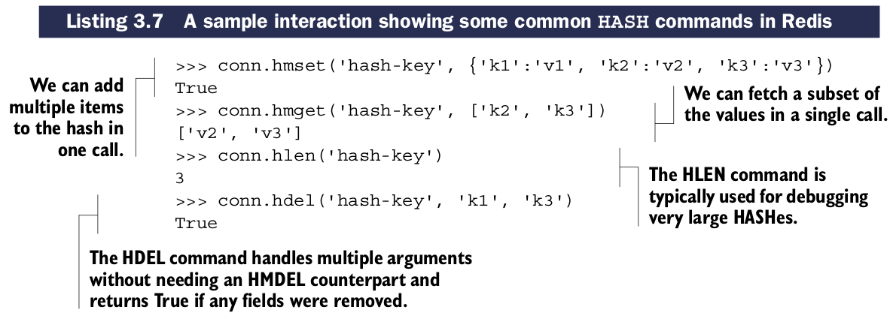
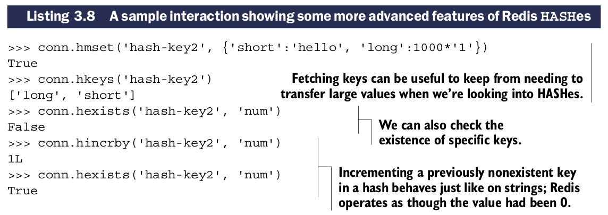

# Hashes

Redis中的``HASHes``存储一组键值对在一个高级别的key中。在功能上这些values提供和``STRINGs`` value相同的功能，并且有助于相关数据分组。这个数据组可以认为非常类似关系型数据库的row或者文档存储中的document。

## HASHes中增删items的操作

| 命令 | 用法示例和描述 |
| ---- | -------------- |
| HMGET | HMGET key-name key [key ...] —— 获取HASH中的value段 |
| HMSET | HMSET key-name key value [key value ...] —— 设置HASH中的value段 |
| HDEL | HDEL key-name key [key ...] —— 删除HASH中的键值对，返回找到并删除的键值数量 |
| HLEN | HLEN key-name —— 返回HASH中的键值对数量 |

## 更多HASHes中的批量操作和STRING-like调用

| 命令 | 用法示例和描述 |
| ---- | -------------- |
| HEXISTS | HEXISTS key-name key —— 返回给定key是否存在于HASH |
| HKEYS | HKEYS key-name —— 获取HASH中的keys |
| HVALS | HVALS key-name —— 获取HASH中的values |
| HGETALL | HGETALL key-name —— 获取HASH中的所有键值对 |
| HINCRBY | HINCRBY key-name key increment —— 使key中的value增加指定的整数 |
| HINCRBYFLOAT | HINCRBYFLOAT key-name key increment —— 使key中的value增加指定的浮点数 |

