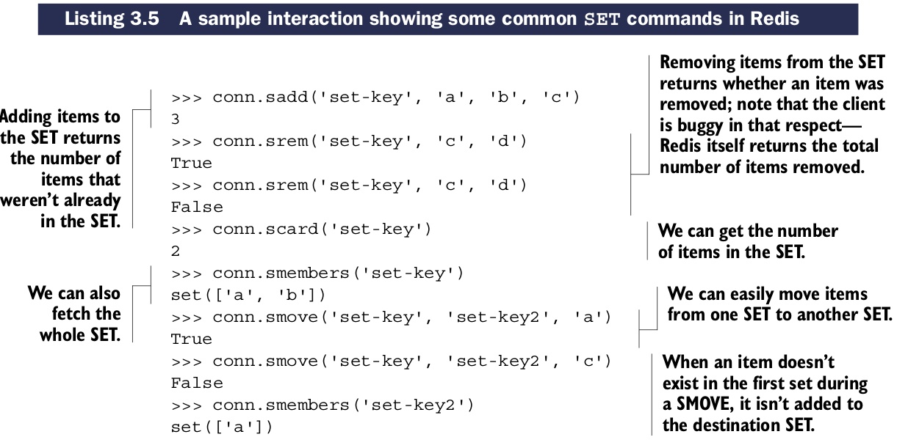
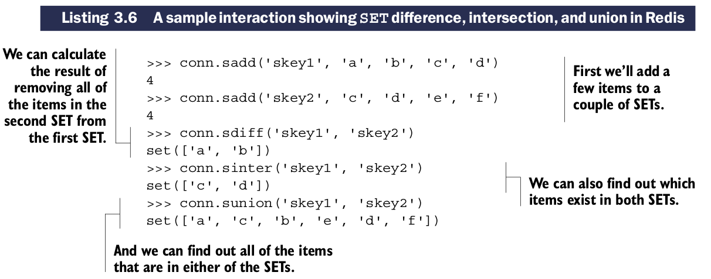

# Sets

## 一些``SET``常用命令

| 命令 | 用法示例描述 |
| -- | -- |
| SADD | SADD key-name item [item ...] —— 将items加入set并返回增加的items的数量 |
| SREM | SREM key-name item [item ...] —— 删除items并返回被删除的items的数量 |
| SISMEMBER | SISMEMBER key-name item —— 返回一个item是否在``SET``中 |
| SCARD | SCARD key-name —— 返回``SET``中items的数量 |
| SMEMBERS | SMEMBERS key-name —— 以Python set类型返回``SET``中所有的items |
| SRANDMEMBER | SRANDMEMBER key-name [count] —— 从``SET``中返回一个或多个随机的items。当count是正数时，Redis返回无重复的随机item，当count是负数时，Redis返回随机items，可能有重复 |
| SPOP | SPOP key-name —— 移除并返回``SET``中随机的item |
| SMOV | SMOVE source-key dest-key item —— 如果source中有item,移除该item并加入到destination,如果移动成功则返回该item |

Python示例：

## 连接多``SETs``的操作

| 命令 | 用法示例和描述 |
| -- | -- |
| SDIFF | SDIFF key-name [key-name ...] —— 返回第一个``SET``中不在其他``SETs``的items(数学中的差集运算) |
| SDIFFSTORE | SDIFFSTORE dest-key key-name [key-name ...] —— 将第一个SET中不在其他SETs中的items存储在dest-key中(数学中的差集运算) |
| SINTER | SINTER key-name [key-name ...] —— 返回在所有SETs中都存在的items(数学中的交集运算) |
| SINTERSTORE | SINTERSTORE dest-key key-name [key-name ...] —— 将所SETs中都存在的items存储在dest-key中(数学中的交集运算) |
| SUNION | SUNION key-name [key-name ...] —— 返回至少在一个SETs中存在的items(数学中的并集运算) |
| SUNIONSTORE | SUNIONSTORE dest-key key-name [key-name ...] —— 将至在一个SETs中存在的items存储在dest-key中(数学中的并集运算) |

这组命令包含三种``SET``操作，有两种版本"return the result"和"store the result"版本。

python操作范例:

Python中的set和Redis中的SETs功能和语义相同，但是提供远程客户端访问的功能。

