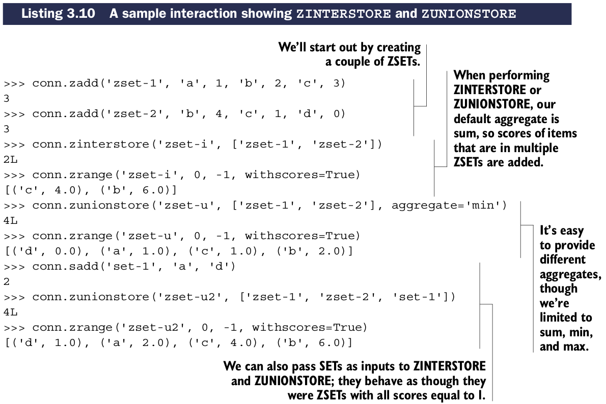
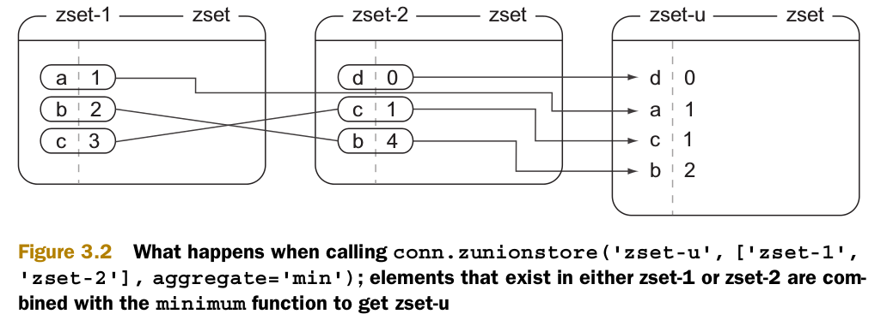

# Sorted sets
``ZSETs``提供存储一组members到scores的mapping的功能(类似于``HASHses``中的keys和values的关系)。这些mapping允许我们操控数字scores，获取和检索members和scores，和基于scores排序。

## 一些``ZSET``常用命令

| 命令 | 用法示例和描述 |
| ---- | -------------- |
| ZADD | ZADD key-name score member [score member ...] —— 将members和scores增加到``ZSET`` |
| ZRED | ZREM key-name member [member ...] —— 从ZSET中移除指定members，返回移除的members数量 |
| ZCARD | ZCARD key-name —— 返回ZSET中的members数量 |
| ZINCRBY | ZINCRBY key-name increment member —— 在ZSET中增加member的score |
| ZCOUNT | ZCOUNT key-name min max —— 返回指定最小值和最大值之间的members数量 |
| ZRANK | ZRANK key-name member —— 返回ZSET中指定member的坐标 |
| ZSCORE | ZSCORE key-name member —— 返回ZSET中member的score |
| ZRANGE | ZRANGE key-name start stop [WITHSCORES] —— 从start和stop范围内返回members和可选的scores |

## 其他有用的命令

| 命令 | 用法示例和描述 |
| ---- | -------------- |
| ZREVRANK | ZREVRANK key-name member —— 返回逆序排序的member的序号 |
| ZREVANGE | ZREVRANGE key-name start stop [WITHSCORES] —— 获取给定范围的members，以逆序排列 |
| ZRANGEBYSCORE | ZRANGEBYSCORE key min max [WITHSCORES] [LIMIT offset count] —— 获取min和max之间的members |
| ZREVRANGEBYSCORE | ZREVRANGEBYSCORE key max min [WITHSCORES] [LIMIT offset count] —— 获取逆序排序的min和max之间的members |
| ZREMRANGEBYRANK | ZREMRANGEBYRANK key-name start stop —— 删除起始范围内的items |
| ZREMRANGEBYSCORE | ZREMRANGEBYRANK key-name min max —— 删除在min和max之间的scores的items |
| ZINTERSTORE | ZINTERSTORE dest-key key-count key [key ...] [WEIGHTS weight [weight ...]] [AGGREGATE SUM|MIN|MAX] —— Performs a SET -like intersection of the provided ZSETs |
| ZUNIONSTORE | ZUNIONSTORE dest-key key-count key [key ...] [WEIGHTS weight [weight ...]] [AGGREGATE SUM|MIN|MAX] —— Perform a SET-like union of the provided ZSETs |

# 下面三个图例讲解了zset的操作

