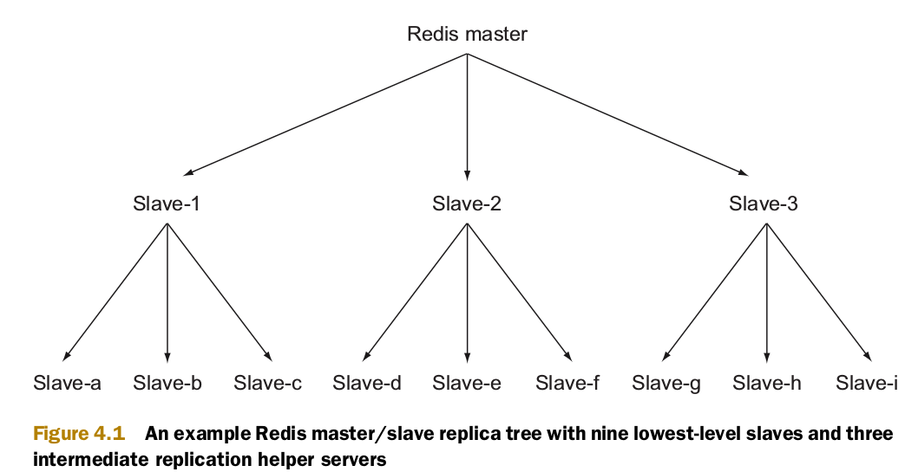

# Master/slave chains

有时开发者们会发现当他们需要复制到一大批从节点时，一些网络无法跟上——尤其是复制集正在跨越互联网或者在数据中心交互时。因为对于Redis来说，master和slave没什么不同，slaves可以有自己的slaves，这将导致产生主/从链。

在操作上，唯一的不同是在复制过程中，如果一个slave X有自己的slave Y，当slave X到达表4.2的第4步时，slave X将会断开slave Y，导致Y重连接并重新同步。

当读负载显著超越写负载时，并且当读取请求远远超越了单一Redis服务器的处理能力时，通常的方法是继续增加slaves提高读性能。随着读负荷不断提高，我们遇到了单一master不能快速写入所有的slaves的情况，我们可能需要建立一个中间层的Redis master/slave节点，可以帮助处理复制过程，类似于图4.1的架构。

