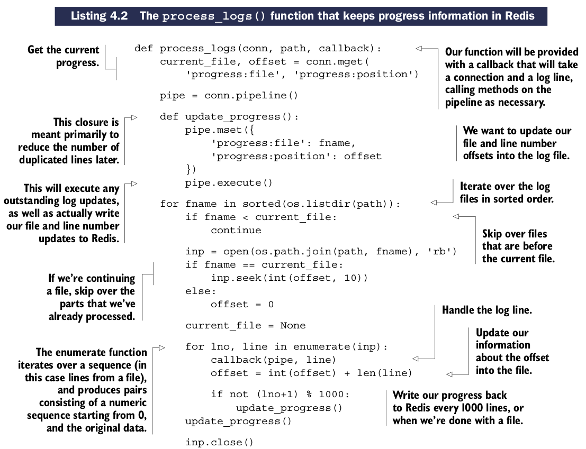

# 以快照形式持久化保存到硬盘

Redis中，我们可以通过创建一个快照来创建一份即时的内存数据的副本。

创建之后，这些快照可以用于备份，拷贝到其他服务器创建一份克隆，或者保存到重启服务之后。

在配置方面，快照写入的文件参照配置中的``dbfilename``，存储路径参照``dir``。如果Redis，系统，或硬件发生崩溃，那么将会丢失到从上次完整快照以来所有的数据。

有以下五种方法创建一个快照:

* 任何Redis客户端可以通过调用``BGSAVE``命令创建一个快照。Redis将会创建一个子进程写入快照到硬盘，父进程继续响应其他Redis命令。
* Redis客户端同样可以调用``SAVE``命令创建一个快照，该命令将会导致Redis停止响应任何其他所有的命令，直到快照写入完成。这条命令并不常用，只有这几种情况可能会用，需要保存所有的数据到硬盘，并且允许等到快照完成，或者我们没有足够的内存执行``BGSAVE``。
* 如果Redis配置了``save``行，比如``save 60 10000``，表示自上次成功保存起，如果在60秒内已经发生10,000次写入，那么将会自动触发一个``BGSAVE``操作。当多行``save``被定义时，任何时间任意一行匹配到，都会触发一个``BGSAVE``。
* 当Redis收到一个``SHUTDOWN``命令，或收到一个标准的``TERM``信号时，Redis将会执行一个``SAVE``，阻断任何客户端执行进一步的命令，然后关闭。
* 如果一个Redis服务器连接到另一个Redis服务器，并且发起``SYNC``命令开启主从同步，主Redis将会启动一个``BGSAVE``操作如果其中一个尚未执行或上次任务未完成。

如果只使用快照保存数据，你必须记住，如果发生崩溃，你将会丢失自上次快照以来所有的数据改变。某些应用程序来说，这种类型的丢失数据是不可接受的，你应该使用append-only file持久性保存。如果你的应用程序允许这些数据丢失，那快照是正确的选择。接下来看几种使用场景，以及如何配置你需要的Redis的快照持久性。

## 开发
对于我个人的开发服务器，我最关心的是最小化的快照开销。因此，加上我信任我的硬件，我只有单一的规则: ``save 900 1``。``save``选项告诉Redis应该基于随后的两个值执行``BGSAVE``。如果在最后的``BGSAVE``过去的900秒(15分钟)发生至少一次写入，Redis将会自动启动一个新的``BGSAVE``。

如果你想在生产服务器上启用快照，并且想要保存大量的数据，那么你应该找一台配置差不多开发服务器，运行同样的配置，同样的数据量，调试期望的负载值。你需要确保快照不要太频繁，也不要太稀少。

## 聚合日志

## 大数据
当我们存储在Redis中的数据少于几个GB时，快照可以做的很好。Redis可以非常快的完成快照。但是，当Redis的数据达到几十GB时``BGSAVE``就不行了。对于大数据量，需要更快的保存数据，可以选用append-only file。
